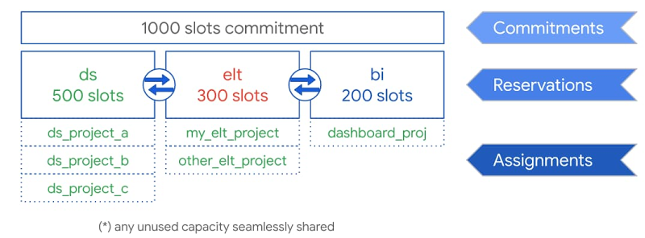

# BigQuery Flex Slots: A programmatic approach

This repository contains code that will deploy two cloud functions that will respectively 
start and stop BigQuery flex slots commitments, reservations and assignments. Definitions of these
concepts are desribed below and taken from this [Google article](https://cloud.google.com/blog/products/data-analytics/optimize-bigquery-costs-with-flex-slots?utm_source=feedburner&utm_medium=email&utm_campaign=Feed:%2Bgoogleblog%2FCNkG%2B(Google%2BCloud%2BPlatform%2BBlog)).

- Flex Slot commitments are purchases charged in increments of 500 slot hours for $20, or ~$0.33/minute. 
You can increase your slot commitments if you need faster queries or more concurrency.  
- Reservations create a named allocation of slots, and are necessary to assign purchased slots to 
a project. Find details on reservations in this documentation.
- Assignments assign reservations to Organizations, Folders, or Projects. All queries in a project 
will switch from on-demand billing to purchased slots after the assignment is made.




### Quickstart

1. [Install Terraform](https://learn.hashicorp.com/terraform/getting-started/install.html)
2. Create a bucket on GCS that will store your terraform state
3. Clone this repository
4. Replace the values in the ["resource.tfvars" file](https://github.com/Fourcast/bq_flex_slots/blob/master/resources.tfvars) 
   with your desired values. "location_flex_slots" has to be either "EU" or "US".
5. Create a service account for Terraform with the primitive role "Editor" and save it at the root of this 
repository under "terraform.json".
6. Replace the placeholder "[TERRAFORM-STATE-BUCKET]" in the ["main.tf" file](https://github.com/Fourcast/bq_flex_slots/blob/master/main.tf)
with the bucket name for your terraform state bucket (will be [project_id]-terraform).
7. Run the following command:
```terraform plan -out tf.plan -var-file=resources.tfvars```
8. Review the resources that will be deployed and then run the following command to apply the plan:
```terraform apply tf.plan```

### Integrate within your code

You know need to call these two funciton programmatically within your code. If you are running a batch of
queries using BigQuery python client, you can call the "start_bq_flex_slot" with the following snippet:

``` 
# Create the request headers needed in order to get an authentification token from the Cloud Function  
metadata_server_token_url = "http://metadata/computeMetadata/v1/instance/service-accounts/default/identity?audience="  # nosec
token_request_url = metadata_server_token_url + [HTTP url of the start_bq_flex_slot]
token_request_headers = {"Metadata-Flavor": "Google"}

# Fetch the token
token_response = requests.get(token_request_url, headers=token_request_headers)
jwt = token_response.content.decode("utf-8")
# Create the header
headers = {"Authorization": f"bearer {jwt}"}

# Create the function parameters
params = {
          "commitment_slots": [commitment_slots],
          "reservation_name": [reservation_name],
          "reservation_slots": [reservation_slots],
          "assignment_project": [assignment_project]
         }

response = requests.get(
                        [HTTP url of the start_bq_flex_slot url],
                        headers=headers,
                        params=params,
                       )
``` 

As the Cloud Functions are not public, you need to authenticate before being able to make a call. The previous
code snippet will that for you. All you need is to grant the role "Cloud Function invoker" to service account
that will be doing this request call to the Cloud Function.

In order to stop all the commitments, reservations and assignments that you currently have, you can include
the following code snippet within your code:

``` 
# Create the request headers needed in order to get an authentification token from the Cloud Function  
metadata_server_token_url = "http://metadata/computeMetadata/v1/instance/service-accounts/default/identity?audience="  # nosec
token_request_url = metadata_server_token_url + [HTTP url of the stop_bq_flex_slot]
token_request_headers = {"Metadata-Flavor": "Google"}

# Fetch the token
token_response = requests.get(token_request_url, headers=token_request_headers)
jwt = token_response.content.decode("utf-8")
# Create the header
headers = {"Authorization": f"bearer {jwt}"}

response = requests.get(
                        [HTTP url of the stop_bq_flex_slot url],
                        headers=headers
                       )
``` 